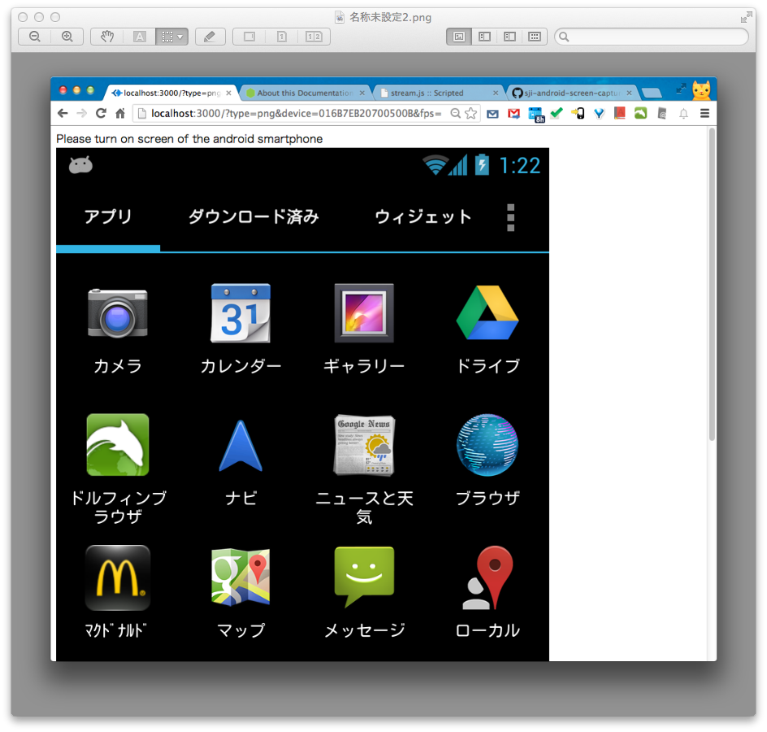
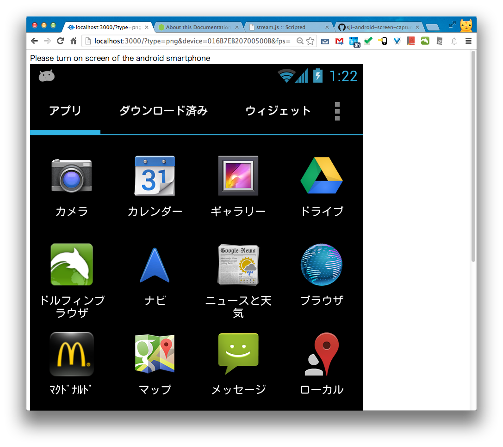

sji-android-screen-capture
===================
android screen capture (for HTML5 video live streaming) 
This project is aimed to capture android screen and view it in HTML5 video capable browser.
Yes, real time, low bandwidth.
This product will do encoding in android by ffmpeg. 
<a href="http://youtu.be/CWcOjzAJ6Sg">recorded video sample( converted by youtube)</a>

[Screenshot] 

[How to use] 

1. setup environment 
    install android SDK (at least need adb(Linux/Unix) or adb.exe (Windows)). 
    install android USB driver automatically or manually. 
    install node.js manually (<a href="http://nodejs.org/download/">download</a>). 
    $> cd path_of_this_project/bin 

3. start stream server 
    connect your android smart phone to PC/Mac by usb cable 
    $> cd path_of_this_project/bin 
    $> node stream.js 

    to show help: node stream.js --help

4. show webm video/animated png in menu page: http://localhost:3000 
for webm video, recommend chrome browser. 
 
    or embed video into your html page: 
    &lt;video controls preload="none" autobuffer="false"&gt; 
	    &lt;source src="http://localhost:3000/capture?device=yourDeviceSerialNumber&type=webm&fps=4" type="video/webm"> 
    &lt;/video&gt; 

    or embed animated png into your html page: 
    &lt;img src="http://localhost:3000/capture?device=yourDeviceSerialNumber&type=png&fps=4" /&gt; 

[Note] 
    Currently tested in android 4.2, 4.1, 2.2. 
    Host OS can be Windows OS or Mac OS X. 
    src/build_all.sh has been tested in Mac OS X 10.7 64bit and Ubuntu 12 64bit.
    android NDK r8 or r9. Gcc 4.4.3 or 4.8 

[Todo] 
    enhance performance! 
    many many...
