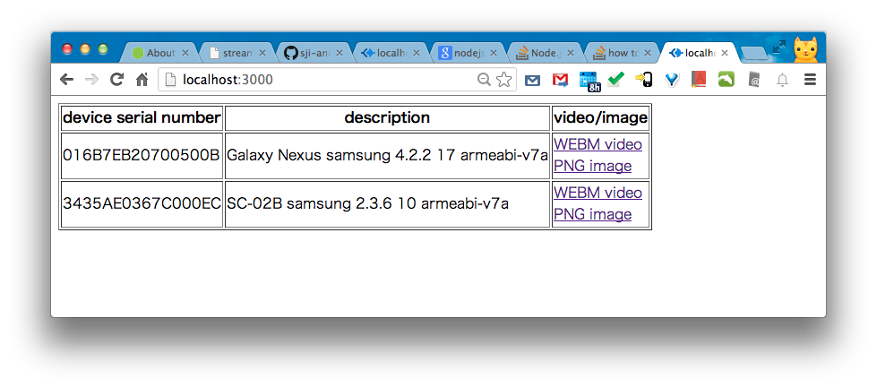

sji-android-screen-capture
===================
<b>Android Screen Capture (For HTML5 Video Live Streaming)</b>  
This project is aimed to capture android screen and view it in HTML5 video capable browser.  
Yes, real time, low bandwidth.  This product will do encoding in android by <a href="http://ffmpeg.org/">ffmpeg</a>.  
<pre><code><a href="http://youtu.be/CWcOjzAJ6Sg">recorded video sample( converted by youtube)</a>  
<a href="http://youtu.be/1wZYHHzMwQ8">Usage video</a></code></pre>
  
[Screenshot]

[How to use]  
  
1.<b>Setup PC Environment (Windows/Mac/Linux/Unix)</b>  
<pre><code><a href="http://developer.android.com/sdk/index.html">Install Android SDK</a> (at least "Platform Tools" which include adb(Android Debug Bridge)).  
<a href="http://nodejs.org/download/">install node.js</a>.  
Install android USB driver automatically or manually when you first plug Android into PC.  
</code></pre>

3.<b>Start Android Screen Capture (include a video stream server) on PC</b>  
<pre><code>cd path_of_this_project/bin  
node stream.js
</code></pre>
to show command line help:  
<pre><code>node stream.js --help
</code></pre>
  
4.<b>Show video/image of android from PC by browsing <a href="http://localhost:3000/">http://localhost:3000/</a></b>  
For video, currently only support <a href="http://www.webmproject.org/">WebM</a> video, so recommend <a href="http://www.google.com/chrome">Google Chrome Browser</a>.  
For image, currently support animated PNG by <a href="http://en.wikipedia.org/wiki/MIME#Mixed-Replace">multi-part http response</a>. Most browser are supported.  
  
To embed webm video into your html page:  
<pre><code>&lt;video controls preload="none" autobuffer="false"&gt;  
  &lt;source src="http://localhost:3000/capture?device=yourDeviceSerialNumber&type=webm&fps=4" type="video/webm">  
&lt;/video&gt;
</code></pre>  
To embed animated png into your html page:  
<pre><code>&lt;img src="http://localhost:3000/capture?device=yourDeviceSerialNumber&type=png&fps=4" /&gt;
</code></pre>
To show static png:  
<pre><code>&lt;img src="http://localhost:3000/capture?device=yourDeviceSerialNumber&type=png&fps=0" /&gt;
</code></pre>
[Note]  
    Currently tested in android 4.2, 4.1, 4.0, 2.2, 2.3.  
    Host OS can be Windows/Mac/Linux (Unix should also be OK, but not tested).  
    src/build_all.sh has been tested in Mac OS X 10.7 64bit and Ubuntu 12 64bit.  
    Android NDK r8 or r9. Gcc 4.4.3 or 4.8  
  
[Todo]  
    enhance performance!  
    many many...
